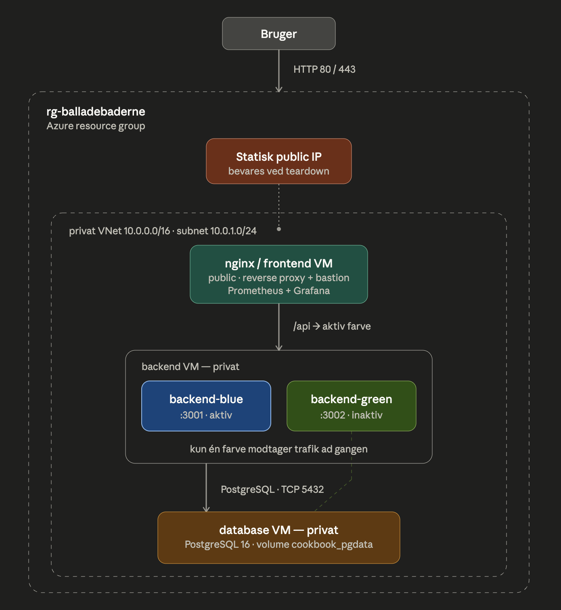

# Cookbook — Recipe Management Application

[](https://github.com/Balladebaderne/cookbook/actions/workflows/ci-cd.yml)
[](./LICENSE)
[](https://github.com/Balladebaderne/cookbook/commits)


A full-stack recipe app — browse, view, and manage recipes. Runs on PostgreSQL
and deploys to Azure with a three-VM blue/green pipeline.

## Table of Contents

- [Tech Stack](#tech-stack)
- [Architecture](#architecture)
- [Project Structure](#project-structure)
- [Deploying to Azure](#deploying-to-azure)
- [Running Locally](#running-locally)
- [Testing & Linting](#testing--linting)
- [Authentication](#authentication)
- [CI/CD Pipeline](#cicd-pipeline)
- [Monitoring](#monitoring)
- [Contributing](#contributing)
- [License](#license)

## Tech Stack

| Layer | Technology |
|-------|------------|
| Backend | Node.js — `node:http` standard library (no framework) |
| Database | PostgreSQL 16 |
| Frontend | React (Vite), served by Nginx |
| API contract | OpenAPI 3.0 (Swagger UI) |
| Containers | Docker + Docker Compose; images in GHCR |
| CI/CD | GitHub Actions |
| Cloud | Azure VMs (Ubuntu 22.04) |
| Monitoring | Prometheus + Grafana (+ cAdvisor, node_exporter) |

## Architecture

Production runs across three Azure VMs in a private VNet; only nginx is public.

<p align="center">
  
</p>

**Blue/green:** a deploy starts the inactive color, health-checks it, then nginx
flips `BACKEND_HOST` to it — zero downtime, instant rollback. Monitoring runs as
a separate stack, reached via nginx at `/grafana/`. Full detail in
[`infrastructure/README.md`](./infrastructure/README.md) and
[`deploy/README-blue-green.md`](./deploy/README-blue-green.md).

## Project Structure

```text
cookbook/
├── backend/                       # Node HTTP API (node:http) + Dockerfile
│   ├── src/                       # index.js, db/, http/, routes/, services/, middleware/
│   └── test/                      # cross-cutting tests (blue-green deploy script)
├── frontend/                      # React (Vite) + nginx Dockerfile
├── infrastructure/                # Azure provisioning (create_three_vms.sh, teardown)
├── deploy/blue-green/             # prod compose + deploy/rollback scripts
├── monitoring/                    # Prometheus/Grafana config + compose
├── docs/                          # architecture.png, authentication.md, sla.md, definition-of-done.md
├── scripts/security-check.sh      # pre-push security gate
├── docker-compose.yml             # local dev (Postgres + backend + frontend)
├── .env.example                   # documented template for all env variables
├── openapi.yaml                   # API contract (source of truth)
└── .github/workflows/ci-cd.yml
```

## Deploying to Azure

Full prerequisites, steps, and teardown live in
[`infrastructure/README.md`](./infrastructure/README.md). Two ways in:

### Option A — View the live app

The application is deployed and running at the static public IP below.

| Status | Endpoint | URL |
|---|---|---|
| 200 | Web UI (React SPA) | `http://4.211.254.152/` |
| 200 | Swagger UI | `http://4.211.254.152/apidocs` |
| 200 | Grafana | `http://4.211.254.152/grafana/` |

> The public IP (`4.211.254.152`) is a static Azure resource in the
> `rg-balladebaderne` resource group of the **shared team subscription**, and is
> preserved across teardown and re-provision: `azure-teardown.sh` keeps the IP,
> and both infra scripts pin that subscription so a stale `az` default can't
> redirect the deploy elsewhere. The IP only changes if the shared subscription
> itself changes — in which case update `SUBSCRIPTION_ID` in the infra scripts
> and this section.

> **Note:** HTTPS (port 443) is not configured yet — all traffic runs over HTTP.

---

### Option B — Deploy your own instance

Spin up a private copy on your Azure subscription and your fork — the group's
live instance is never touched. One script,
[`create_three_vms.sh`](./infrastructure/create_three_vms.sh), does the heavy
lifting; you handle three things it can't.

#### What you need installed

| Tool | Why | Install |
|---|---|---|
| **Azure CLI** (`az`) | provisions the VMs (needs room for 3× `Standard_B1s` + 1 static IP) | [install](https://learn.microsoft.com/cli/azure/install-azure-cli) |
| **GitHub CLI** (`gh`) | sets the deploy secrets and triggers the build | [install](https://github.com/cli/cli#installation) |
| **`ssh` + `ssh-keygen`** | connects to the VMs (preinstalled on macOS/Linux/WSL) | — |

No need to log in or create an SSH key first — the script prompts for both.
_Windows: run from **WSL** or **Git Bash**, never PowerShell or `cmd`._

#### You do these three things

1. **Fork & clone**, then step in:
   ```bash
   gh repo fork Balladebaderne/cookbook --clone && cd cookbook
   ```
2. **Turn on Actions** — your fork → **Actions** tab →
   _"I understand my workflows, enable them"_. Fresh forks ship with Actions off,
   and this is the one switch the script can't flip for you.
3. **Run the script** and answer its prompts:
   ```bash
   bash infrastructure/create_three_vms.sh        # ~10–15 min
   ```
   Override the region with `LOCATION=westeurope` (default: `francecentral`).

#### The script handles the rest

- **Signs you in** — runs `az login` / `gh auth login` if needed, and adds the
  missing `workflow` scope.
- **Sorts the SSH key** — reuses one from `~/.ssh/`, or offers to generate an
  `ed25519` key if you have none.
- **Provisions** — three VMs (public nginx + private backend + private
  database), Docker, locked-down networking, and the static public IP.
- **Deploys** — writes the GitHub secrets and ships the first build, printing
  the public IP + SSH commands when it's green.

It shows a summary and waits for your `y` before creating anything. From then
on, every push to `master` on your fork redeploys automatically.

#### Tear it all down

```bash
bash infrastructure/azure-teardown.sh
```

## Running Locally

**Only prerequisite:** [Docker Desktop](https://www.docker.com/products/docker-desktop/)
(or Docker Engine + Compose v2). Node, PostgreSQL, and nginx all run in
containers — nothing else to install.

```bash
git clone https://github.com/Balladebaderne/cookbook.git
cd cookbook
docker compose --profile dev up -d --build   # Postgres + backend + frontend
```

Then open **<http://localhost>**. The database is created and seeded
automatically on first boot — no extra setup.

- Frontend: <http://localhost>
- API: <http://localhost/api> · Swagger UI: <http://localhost/apidocs> (via nginx)
- Stop: `docker compose --profile dev down` (add `-v` to also wipe the database)

**Configuration:** local dev works with the defaults baked into
`docker-compose.yml`. To override anything (passwords, JWT secret, ports),
copy [`.env.example`](./.env.example) to `.env` — every variable is
documented there. Running the backend directly instead
(`cd backend && npm run dev`) serves it on `:3000` and needs a reachable
Postgres (see `.env.example`).

## Testing & Linting

Backend tests run against a real PostgreSQL; start the stack first, then:

```bash
cd backend && npm test                # 26 tests
cd backend && npm run test:coverage   # ~84% line coverage (70% enforced)
cd frontend && npm test               # no database needed
cd frontend && npm run test:coverage  # writes coverage/lcov.info for SonarQube
```

ESLint runs per package (`npm run lint`) and on every Docker build and in CI.
Both packages emit an `lcov.info` report (`npm run test:coverage`) that is fed to
SonarQube Cloud in CI — see [CI/CD Pipeline](#cicd-pipeline).

## Authentication

Browsing is open; creating/editing/deleting recipes needs a JWT
(`Authorization: Bearer <jwt>`). Full flow in
[`docs/authentication.md`](./docs/authentication.md).

## CI/CD Pipeline

[`ci-cd.yml`](./.github/workflows/ci-cd.yml) runs on push to `master`/`dev`:

1. **dependency-audit** — `npm audit`, lint, and tests (against a Postgres service) for both packages.
2. **build-and-push** — builds backend + frontend images → `ghcr.io/balladebaderne/cookbook-*`.
3. **deploy** — `master` only. Runs in stages across the **three** VMs: database
   → inactive backend color (health-checked, then nginx switches to it) → nginx,
   which also brings up the monitoring stack on the same VM.

### Code quality — SonarQube Cloud

[`sonarqube.yml`](./.github/workflows/sonarqube.yml) is a **separate** workflow
(it never touches the deploy pipeline). On every push to `master`/`dev` and on
every pull request it generates `lcov.info` for both packages and runs the
[SonarQube Cloud](https://sonarcloud.io) scanner. On a PR, SonarQube Cloud
decorates the pull request with a **Quality Gate** check — new bugs, code smells,
security hotspots, duplication, and coverage on the changed lines — and can block
the merge if the gate fails. The shared config lives in
[`sonar-project.properties`](./sonar-project.properties).

**One-time enablement (repo admin):**

1. Sign in at <https://sonarcloud.io> with GitHub and create/confirm the
   organization for `Balladebaderne`, then **Add project** → import `cookbook`.
2. Under the project's *Administration → Analysis Method*, **turn off Automatic
   Analysis** (CI-based analysis and Automatic Analysis are mutually exclusive).
3. Verify `sonar.organization` / `sonar.projectKey` in `sonar-project.properties`
   match the project's *Information* page.
4. Generate a token (*My Account → Security*) and add it as the GitHub Actions
   repository secret **`SONAR_TOKEN`**.

After that, push or open a PR and the Quality Gate check appears automatically.
Add the badge once the project exists:
`[](https://sonarcloud.io/summary/new_code?id=Balladebaderne_cookbook)`

## Monitoring

Prometheus + Grafana run as a separate stack on the shared `cookbook-network`
and are **deployed to prod** alongside the app — Grafana is live at
<http://4.211.254.152/grafana/>. Prometheus stays internal.

The provisioned **"Cookbook — Application Overview"** dashboard tracks request
rate, p95 latency, 5xx error rate, and container up/down (from the backend's
`/metrics`). cAdvisor (containers) and node_exporter (host) add the
infrastructure view. Data is retained 15 days in Docker volumes. Grafana
credentials come from `GF_ADMIN_USER` / `GF_ADMIN_PASSWORD` (self-sign-up off).

To run the stack locally, start the app first, then bring monitoring up on top:

```bash
docker compose --profile dev up -d                       # creates cookbook-network
docker compose -f monitoring/docker-compose.yml up -d    # monitoring on top
```

Grafana is then at <http://localhost/grafana> (or `:3001`), Prometheus at
<http://localhost:9090>.

## Contributing

See [`AGENTS.md`](./AGENTS.md) for the Git flow, the security gate, and
do-not-touch paths. Git hooks are managed by **Husky** — run `npm install` at
the repo root once to enable them (pre-commit lints; pre-push runs frontend
tests + `scripts/security-check.sh`). Work tracked on the
[Kanban board](https://github.com/orgs/Balladebaderne/projects/2);
progress is recorded in [`definition-of-done.md`](./docs/definition-of-done.md).

## License

[MIT](./LICENSE) © BalladeBaderne
