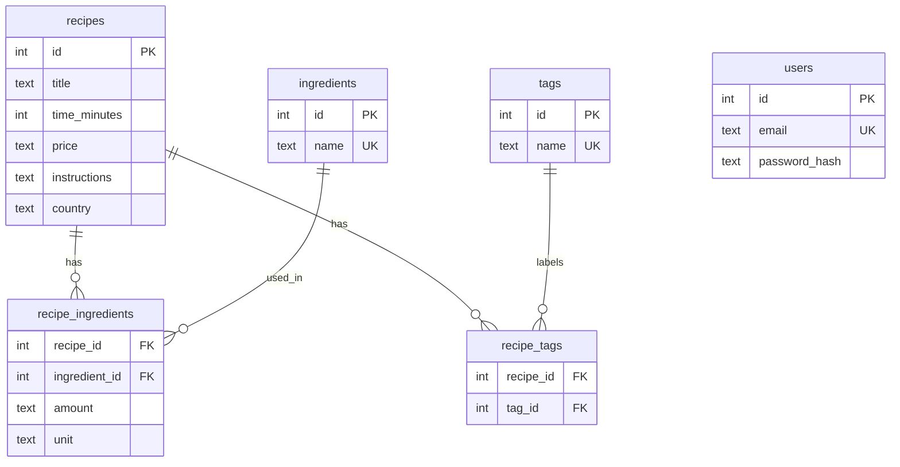
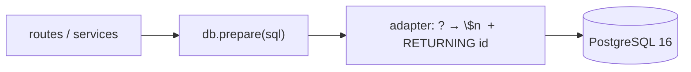
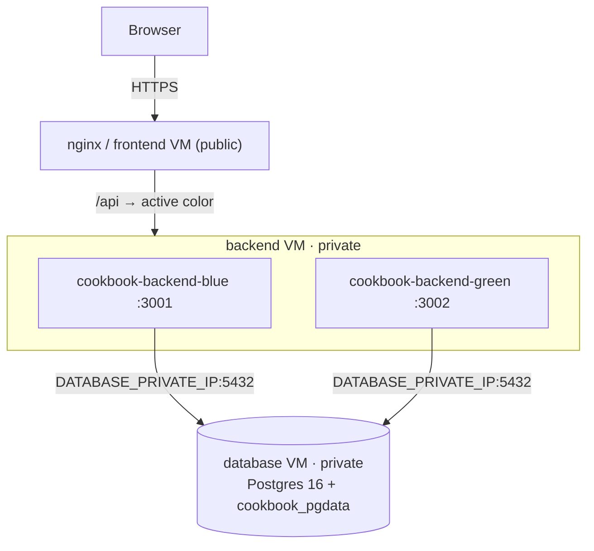

# Exam Feature — Database Migration: SQLite → PostgreSQL

This document describes the new database feature the team built this semester: a
migration from a single-file **SQLite** database to a networked **PostgreSQL 16**
database running on its own VM. It covers the *before/after* state, the migration
strategy, the DevOps choices behind it, and how the cut-over was carried out.

> The report's *Database Migration* section is the narrative around this feature;
> this file is the technical reference it points to.

Repository: <https://github.com/Balladebaderne/cookbook>

---

## 1. Why migrate

The Node backend originally used SQLite through the `sqlite3` package: one file
(`app.db`) on a single VM, mounted in a Docker volume. That was fine for one box,
but it does not fit the production topology we moved to:

- **Blue/green + multiple tiers.** Two backend containers (`blue` and `green`)
  run at the same time, and we split the system across three VMs. A local file
  cannot be shared safely between two backend processes, let alone across hosts.
- **State coupled to a host.** The data lived next to the app, so the database
  shared the lifecycle of a stateless, frequently-redeployed service.
- **Dev/prod drift.** A file DB in dev versus anything "real" in prod is exactly
  the kind of gap DevOps tries to close.

**Goal:** PostgreSQL as the *only* database, reachable over the network by both
backend colors, running as an isolated, stateful tier — and identical across
local development, CI, and production.

---

## 2. Before / after

| | Before | After |
|---|---|---|
| Engine | SQLite (`sqlite3`) | PostgreSQL 16 (`pg`) |
| Location | `app.db` file in a Docker volume | Dedicated **database VM**, named volume `cookbook_pgdata` |
| Reach | In-process, single host | TCP `:5432` over the Azure private network |
| Config | `DB_PATH` | `DATABASE_URL` *or* `POSTGRES_*` env vars |
| Dev / CI | SQLite (incl. `:memory:` for tests) | Real Postgres 16 (compose service / CI service container) |
| Schema id | SQLite rowid | `INTEGER GENERATED BY DEFAULT AS IDENTITY` |

The relational model itself was preserved — only the engine and where it runs
changed.



---

## 3. Migration strategy — an adapter, not a rewrite

The core decision was to migrate **behind a stable interface** instead of
rewriting the data layer. The service/query code already talked to the database
through a small statement interface:

```js
db.prepare(sql) → { run(...params), all(...params), get(...params) }
```

We kept that interface byte-for-byte and swapped only the implementation, so
**no service or route code had to change**. Two small shims let the existing
SQLite-flavoured SQL run unchanged on Postgres
([`backend/src/db/index.js`](../backend/src/db/index.js)):

- **`toPostgresSql()`** rewrites positional `?` placeholders to `$1, $2, … $n`.
- **`sqlWithReturningId()`** appends `RETURNING id` to `INSERT`s so `run()` can
  still report `lastInsertRowid` — the value the seeder relies on to link
  recipes to their ingredients and tags.

Real transactions are provided via a pooled client and `BEGIN/COMMIT/ROLLBACK`
(`db.transaction()`), used by the seeder so a partial seed never lands.
Connection settings come entirely from the environment
(`DATABASE_URL` or `POSTGRES_HOST/PORT/DB/USER/PASSWORD`).

Because the new `PostgresDatabase` implemented the same contract as the old
`SQLiteDatabase`, both engines could coexist during the transition. This is a
**strangler-style** migration: introduce the replacement next to the original,
prove it in dev → CI → prod, then delete the original. SQLite was only removed
once Postgres was green everywhere.



---

## 4. Schema bootstrap & seeding — the "migration" mechanism

We deliberately avoided a separate migration runner. The schema applies itself,
idempotently, on every boot ([`backend/src/db/schema.js`](../backend/src/db/schema.js)):

- `CREATE TABLE IF NOT EXISTS` for `recipes`, `users`, `ingredients`, `tags`,
  and the `recipe_ingredients` / `recipe_tags` junction tables.
- `ALTER TABLE recipes ADD COLUMN IF NOT EXISTS country` — an additive change
  that upgrades databases created before the column existed.
- Indexes on the junction tables for faster JOIN lookups.
- **Seed-on-empty:** when `recipes` is empty, `seedDb()` loads
  [`seed.json`](../backend/src/db/seed.json) (20 recipes) inside a single
  transaction, find-or-creating ingredients/tags into their junction tables
  ([`backend/src/db/seed.js`](../backend/src/db/seed.js)).

Net effect: provisioning needs only **an empty database and an owning user** —
the app creates its own schema and seeds itself on first boot. The exact same
code path runs in dev, CI, and production, which is what gives us parity.

> **Operational caveat:** seeding only runs when `recipes` is empty, and the
> production volume persists across deploys, so editing `seed.json` does **not**
> update an already-seeded prod database. The manual re-seed procedure is
> documented in [`deploy/README-blue-green.md`](../deploy/README-blue-green.md)
> (tracked by issue #120).

---

## 5. Production: a dedicated database tier (three VMs)

Postgres runs as a single container on its own **database VM**, defined in
[`deploy/blue-green/postgres.yml`](../deploy/blue-green/postgres.yml): Postgres 16,
named volume `cookbook_pgdata`, a `pg_isready` healthcheck, and
`restart: unless-stopped`. It is a **one-time, stateful** setup and is
intentionally **not** part of the per-deploy CI flow — so shipping a new app
version never touches the data.



- Both backend colors connect to the database VM at `DATABASE_PRIVATE_IP:5432`.
  CI maps `DATABASE_PRIVATE_IP` → `POSTGRES_HOST`.
- The Azure NSG only allows port `5432` **from the backend VM**, so publishing
  the port on the database VM is not publicly reachable.
- Credentials come from GitHub Actions secrets (`POSTGRES_DB`, `POSTGRES_USER`,
  `POSTGRES_PASSWORD`), written to a `chmod 600` env file on the VM — never
  hard-coded in the compose file.

The CI/CD pipeline reflects this separation: a `deploy-three-vms-database` job
brings Postgres up on its own VM, and the backend/nginx deploy jobs run
afterwards ([`.github/workflows/ci-cd.yml`](../.github/workflows/ci-cd.yml)).

---

## 6. DevOps choices

1. **Strangler / adapter migration** — replace behind a stable interface, run
   both engines side by side, cut over only when proven. Incremental and
   reversible, not a big-bang rewrite.
2. **Dev / CI / prod parity** — Postgres 16 everywhere. Local dev runs it as a
   compose service with a healthcheck and `depends_on: service_healthy`
   ([`docker-compose.yml`](../docker-compose.yml)); CI runs the same image as a
   service container and runs the test suite against it. No "works on my
   machine."
3. **12-factor config & secrets** — connection is pure environment; secrets live
   in GitHub Actions + a locked-down VM env file; the network is fenced by the
   NSG. Nothing sensitive in the repo (enforced by `scripts/security-check.sh`).
4. **Separation of concerns** — the stateful database tier is isolated from the
   stateless, frequently-redeployed app tier, with independent lifecycles. An
   app deploy can never put data at risk.
5. **Idempotent, self-applying schema** — repeatable provisioning with no
   out-of-band migration step; a fresh VM bootstraps itself.
6. **Blue/green-safe migrations (expand–contract)** — because two backend colors
   run simultaneously, schema changes must stay backwards compatible: add
   tables/columns first, deploy code that handles both shapes, backfill, and
   only drop old fields in a later release (see the *Migration Rule* in
   [`deploy/README-blue-green.md`](../deploy/README-blue-green.md)).
7. **Traceability** — work happened on a dedicated `database-migration` branch,
   linked to issues and reflected in the
   [Definition of Done](./definition-of-done.md).

---

## 7. How the migration was carried out

| Step | What | Commit(s) | Date |
|---|---|---|---|
| 1 | Add Postgres driver + adapter (`pg` Pool, `?`→`$n`, `RETURNING id`, env config) **alongside** SQLite | `da66df5` | 2026-05-20 |
| 2 | Dedicated database tier: `postgres.yml` for the three-VM DB VM + CI database deploy job | `1a85438`, `de79f3a` | 2026-05-20 |
| 3 | Cut dev + CI over to real Postgres; **remove SQLite** (drop `sqlite3`, `DB_PATH`; Postgres-native schema) | `b0501e5`, `fa8dfc5`, `d649ede`, `b44ba14` (branch `feature/remove-sqlite`, merged `374f45a`) | 2026-05-23 |

Steps 1–2 made Postgres available without breaking anything; step 3 made it the
only database once it was green in dev, CI, and prod. The removal was Phase 3 of
the cleanup epic (#63).

---

## 8. Verification

- Backend tests run against a **real Postgres** (CI service container and the dev
  compose stack), not a mock — `npm run test:coverage` ≈ 84 % line coverage.
- `pg_isready` healthchecks gate startup in dev (`depends_on: service_healthy`)
  and on the production database VM.
- The blue/green health check gates the nginx color switch, so a backend that
  cannot reach Postgres never receives live traffic.

---

## 9. Trade-offs & what we'd do differently

- **No versioned migration tool.** `CREATE TABLE IF NOT EXISTS` +
  `ADD COLUMN IF NOT EXISTS` handles additive changes cleanly but cannot express
  renames, destructive changes, or versioned rollbacks. For a longer-lived
  product we'd add a real migration runner (e.g. node-pg-migrate / Flyway).
- **Seed-on-empty only.** Convenient for first boot, but seed edits don't reach
  an already-seeded prod DB without a manual re-seed (#120).
- **Single Postgres instance.** No replica, automated backups, or HA yet — the
  next step for a production-grade data tier.
